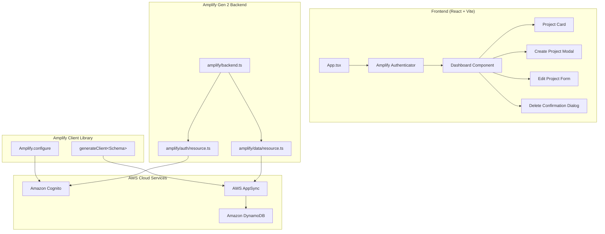
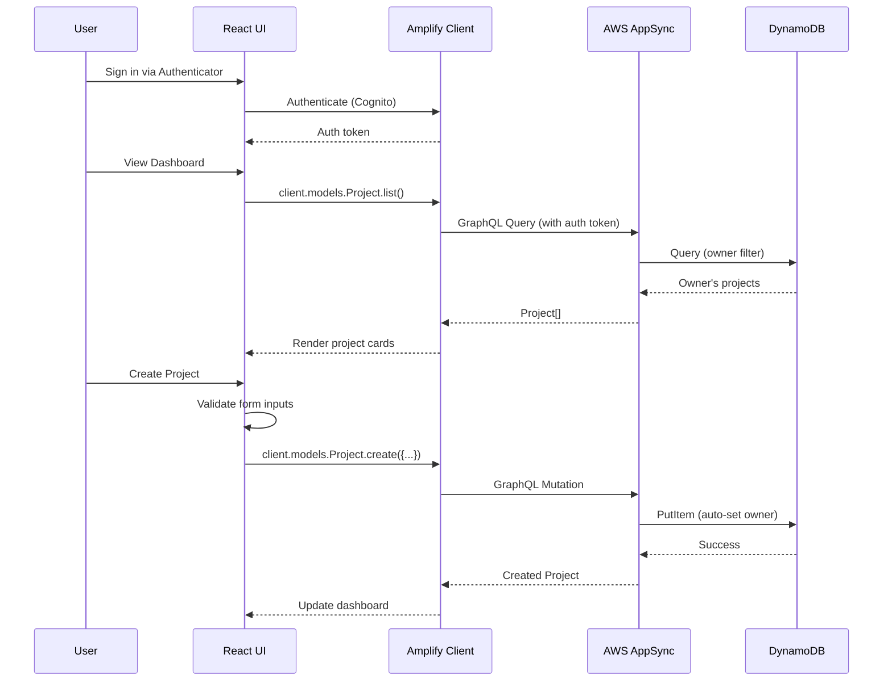

# Design Document

## Overview

This document describes the technical design for the Project Tracker application — a full-stack demo built with AWS Amplify Gen 2, React (Vite), TypeScript, and Tailwind CSS. The application provides authenticated users with a personal dashboard to create, view, update, and delete projects with per-user data isolation enforced at the API level.

### Key Design Decisions

1. **Amplify Gen 2 code-first approach**: Backend resources (auth, data) are defined in TypeScript files under the `amplify/` directory, providing type safety and CDK-based infrastructure.
2. **Owner-based authorization**: Amplify's built-in `allow.owner()` authorization strategy handles per-user data isolation at the AppSync resolver level — no custom authorization logic needed in the frontend.
3. **Shadcn/UI + Tailwind CSS**: Component library provides accessible, composable primitives while Tailwind handles all styling. No CSS modules or styled-components.
4. **Amplify Authenticator component**: Pre-built UI component handles the entire sign-up/sign-in flow, reducing custom auth UI code to near zero.
5. **Client-side validation with server-side enforcement**: Form validation runs in the browser for UX, while the AppSync schema enforces constraints at the API level as the source of truth.

### Research Findings

- **Amplify Gen 2 Auth**: Uses `defineAuth()` from `@aws-amplify/backend` with `loginWith: { email: true }` for email-based authentication. Cognito handles email verification automatically. ([Source](https://docs.amplify.aws/nextjs/build-a-backend/auth/set-up-auth/))
- **Amplify Gen 2 Data**: Uses `defineData()` with `a.schema()` and `a.model()` to define DynamoDB-backed models. Owner authorization is configured via `.authorization(allow => [allow.owner()])` which auto-populates an `owner` field. ([Source](https://docs.amplify.aws/nextjs/build-a-backend/data/customize-authz/per-user-per-owner-data-access/))
- **Type-safe client**: `generateClient<Schema>()` provides full TypeScript inference for all CRUD operations on the frontend. ([Source](https://docs.amplify.aws/vue/build-a-backend/data/set-up-data/))

## Architecture



### Data Flow



## Components and Interfaces

### Backend Components

#### `amplify/auth/resource.ts`
```typescript
import { defineAuth } from '@aws-amplify/backend';

export const auth = defineAuth({
  loginWith: {
    email: true,
  },
});
```

#### `amplify/data/resource.ts`
```typescript
import { a, defineData, type ClientSchema } from '@aws-amplify/backend';

const schema = a.schema({
  Project: a.model({
    title: a.string().required(),
    description: a.string(),
    status: a.enum(['Not Started', 'In Progress', 'Completed']),
  })
  .authorization(allow => [allow.owner()]),
});

export type Schema = ClientSchema<typeof schema>;

export const data = defineData({
  schema,
  authorizationModes: {
    defaultAuthorizationMode: 'userPool',
  },
});
```

#### `amplify/backend.ts`
```typescript
import { defineBackend } from '@aws-amplify/backend';
import { auth } from './auth/resource';
import { data } from './data/resource';

defineBackend({
  auth,
  data,
});
```

### Frontend Components

| Component | Responsibility | Props/State |
|-----------|---------------|-------------|
| `App` | Root component, wraps with Authenticator | Auth state |
| `Dashboard` | Fetches and displays projects, manages layout | `projects[]`, `loading`, `error` |
| `ProjectCard` | Displays a single project's info | `project`, `onEdit`, `onDelete` |
| `CreateProjectModal` | Form for creating a new project | `open`, `onClose`, `onSubmit` |
| `EditProjectForm` | Form for editing an existing project | `project`, `open`, `onClose`, `onSubmit` |
| `DeleteConfirmDialog` | Confirmation before deletion | `project`, `open`, `onConfirm`, `onCancel` |
| `Header` | App title and sign-out button | `onSignOut`, `user` |

### Component Hierarchy

```
<Authenticator>
  <App>
    <Header />
    <Dashboard>
      <ProjectCard /> (×N)
      <CreateProjectModal />
      <EditProjectForm />
      <DeleteConfirmDialog />
    </Dashboard>
  </App>
</Authenticator>
```

### Key Interfaces

```typescript
// Project status enum
type ProjectStatus = 'Not Started' | 'In Progress' | 'Completed';

// Form data for create/edit
interface ProjectFormData {
  title: string;        // 1-100 characters
  description?: string; // 0-500 characters
  status: ProjectStatus;
}

// Validation result
interface ValidationResult {
  valid: boolean;
  errors: Record<string, string>;
}

// Project as returned from the API
interface Project {
  id: string;
  title: string;
  description?: string;
  status: ProjectStatus;
  owner: string;
  createdAt: string;
  updatedAt: string;
}
```

### Validation Logic

```typescript
function validateProjectForm(data: ProjectFormData): ValidationResult {
  const errors: Record<string, string> = {};

  if (!data.title || data.title.trim().length === 0) {
    errors.title = 'Title is required';
  } else if (data.title.length > 100) {
    errors.title = 'Title must be 100 characters or less';
  }

  if (data.description && data.description.length > 500) {
    errors.description = 'Description must be 500 characters or less';
  }

  return {
    valid: Object.keys(errors).length === 0,
    errors,
  };
}
```

### Description Truncation

```typescript
function truncateDescription(description: string, maxLength: number = 100): string {
  if (description.length <= maxLength) return description;
  return description.slice(0, maxLength) + '…';
}
```

## Data Models

### Project Model (DynamoDB)

| Field | Type | Constraints | Notes |
|-------|------|-------------|-------|
| `id` | String | Auto-generated | Partition key, UUID |
| `title` | String | Required, max 200 chars (schema) | Frontend enforces max 100 |
| `description` | String | Optional, max 2000 chars (schema) | Frontend enforces max 500 |
| `status` | Enum | "Not Started" \| "In Progress" \| "Completed" | Defaults to "Not Started" |
| `owner` | String | Auto-populated by Amplify | Cognito user identity |
| `createdAt` | AWSDateTime | Auto-managed | Set on creation |
| `updatedAt` | AWSDateTime | Auto-managed | Updated on mutation |

### Authorization Rules

The `allow.owner()` rule on the Project model means:
- **Create**: Only authenticated users can create; `owner` is auto-set to the creator's identity
- **Read**: Only the owner can read their own records
- **Update**: Only the owner can update their own records
- **Delete**: Only the owner can delete their own records

Queries automatically filter by the authenticated user's identity — no frontend filtering needed.

### State Management

The application uses React component state (useState/useEffect) rather than a global state library, given the simple data flow:

```typescript
// Dashboard state
const [projects, setProjects] = useState<Project[]>([]);
const [loading, setLoading] = useState(true);
const [error, setError] = useState<string | null>(null);
const [createModalOpen, setCreateModalOpen] = useState(false);
const [editingProject, setEditingProject] = useState<Project | null>(null);
const [deletingProject, setDeletingProject] = useState<Project | null>(null);
```


## Correctness Properties

*A property is a characteristic or behavior that should hold true across all valid executions of a system — essentially, a formal statement about what the system should do. Properties serve as the bridge between human-readable specifications and machine-verifiable correctness guarantees.*

### Property 1: Title validation correctness

*For any* string input, the project form validation function SHALL accept the title if and only if the trimmed string has a length between 1 and 100 characters (inclusive). Strings that are empty, contain only whitespace, or exceed 100 characters SHALL be rejected with an appropriate error message.

**Validates: Requirements 5.2, 5.5, 5.7**

### Property 2: Description validation correctness

*For any* string input provided as a description, the project form validation function SHALL accept it if its length is between 0 and 500 characters (inclusive), and SHALL reject it with an appropriate error message if it exceeds 500 characters. An absent (undefined) description SHALL always be accepted.

**Validates: Requirements 5.3**

### Property 3: Project sort ordering

*For any* list of projects with distinct `createdAt` timestamps, sorting them for dashboard display SHALL produce a list where each project's `createdAt` is greater than or equal to the next project's `createdAt` (most recent first).

**Validates: Requirements 6.1**

### Property 4: Description truncation preserves short strings and truncates long ones

*For any* string, if its length is less than or equal to 100 characters, the truncation function SHALL return it unchanged. If its length exceeds 100 characters, the truncation function SHALL return a string of exactly 101 characters consisting of the first 100 characters of the original followed by an ellipsis character ('…').

**Validates: Requirements 6.2**

## Error Handling

### Authentication Errors

| Scenario | Handling | User Feedback |
|----------|----------|---------------|
| Invalid credentials | Caught by Authenticator component | Error message displayed in sign-in form |
| Unverified email | Caught by Authenticator component | Prompt to verify email |
| Network failure during auth | Caught by Authenticator component | Generic network error message |
| Session expired | Amplify auto-refreshes tokens; if refresh fails, redirect to sign-in | Authenticator re-displayed |

### Data Operation Errors

| Scenario | Handling | User Feedback |
|----------|----------|---------------|
| Create project fails | Catch error from `client.models.Project.create()` | Error toast/message, modal stays open with data preserved |
| Fetch projects fails | Catch error from `client.models.Project.list()` | Error message in dashboard, retry option |
| Update project fails | Catch error from `client.models.Project.update()` | Error toast/message, edit form stays open with data preserved |
| Delete project fails | Catch error from `client.models.Project.delete()` | Error toast/message, project remains in list |
| Authorization denied | AppSync returns auth error | Generic "operation not permitted" message |

### Validation Errors

| Scenario | Handling | User Feedback |
|----------|----------|---------------|
| Empty title | Client-side validation before API call | Inline error: "Title is required" |
| Title > 100 chars | Client-side validation before API call | Inline error: "Title must be 100 characters or less" |
| Description > 500 chars | Client-side validation before API call | Inline error: "Description must be 500 characters or less" |

### Error Handling Pattern

```typescript
async function handleCreateProject(formData: ProjectFormData) {
  const validation = validateProjectForm(formData);
  if (!validation.valid) {
    setFormErrors(validation.errors);
    return;
  }

  try {
    setSubmitting(true);
    const { data: project, errors } = await client.models.Project.create({
      title: formData.title.trim(),
      description: formData.description?.trim() || undefined,
      status: formData.status,
    });

    if (errors) {
      setApiError('Failed to create project. Please try again.');
      return;
    }

    setCreateModalOpen(false);
    // Project appears in list via refetch or optimistic update
  } catch (error) {
    setApiError('An unexpected error occurred. Please try again.');
  } finally {
    setSubmitting(false);
  }
}
```

## Testing Strategy

### Unit Tests

Unit tests cover specific examples, edge cases, and component rendering:

- **Validation function**: Specific examples (empty string, exactly 100 chars, 101 chars, whitespace-only)
- **Truncation function**: Specific examples (empty string, exactly 100 chars, 101 chars, Unicode characters)
- **Component rendering**: Dashboard renders loading state, empty state, error state, project cards
- **Form behavior**: Modal opens/closes, form pre-populates on edit, cancel discards changes
- **Error states**: API failure shows error message, form data preserved on failure

### Property-Based Tests

Property-based tests verify universal properties across randomized inputs using [fast-check](https://github.com/dubzzz/fast-check):

| Property | Test Description | Min Iterations |
|----------|-----------------|----------------|
| Property 1 | Generate random strings (including empty, whitespace, long), verify validation accepts iff trimmed length is 1-100 | 100 |
| Property 2 | Generate random strings (including empty, long), verify description validation accepts iff length is 0-500 | 100 |
| Property 3 | Generate random project arrays with random timestamps, verify sort produces descending createdAt order | 100 |
| Property 4 | Generate random strings of varying lengths, verify truncation behavior matches specification | 100 |

**Configuration:**
- Library: `fast-check` (TypeScript property-based testing)
- Minimum iterations: 100 per property
- Each test tagged with: `Feature: amplify-project-tracker, Property {N}: {description}`

### Integration Tests

Integration tests verify end-to-end behavior with the Amplify backend:

- Authentication flow (sign-up, sign-in, sign-out)
- CRUD operations against real AppSync/DynamoDB
- Owner-based authorization (cross-user access denied)
- Data persistence and retrieval

### Test File Structure

```
src/
├── lib/
│   ├── validation.ts          # validateProjectForm()
│   ├── validation.test.ts     # Unit tests
│   ├── validation.property.test.ts  # Property tests (Properties 1, 2)
│   ├── utils.ts               # truncateDescription(), sortProjects()
│   ├── utils.test.ts          # Unit tests
│   └── utils.property.test.ts # Property tests (Properties 3, 4)
├── components/
│   ├── Dashboard.test.tsx     # Component unit tests
│   ├── ProjectCard.test.tsx
│   └── CreateProjectModal.test.tsx
└── __tests__/
    └── integration/
        └── project-crud.test.ts  # Integration tests (requires sandbox)
```
